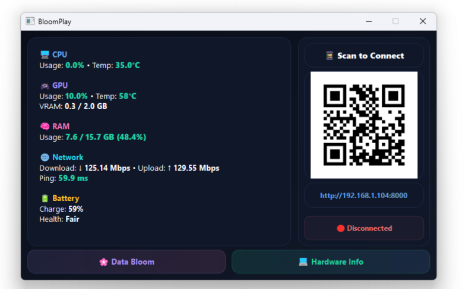
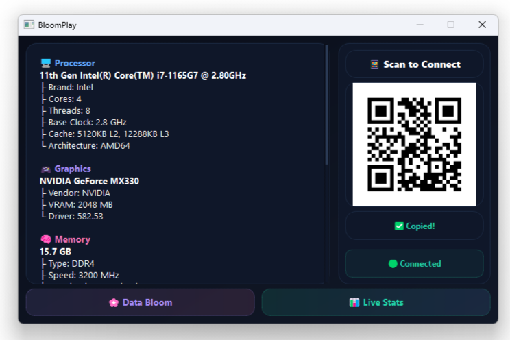
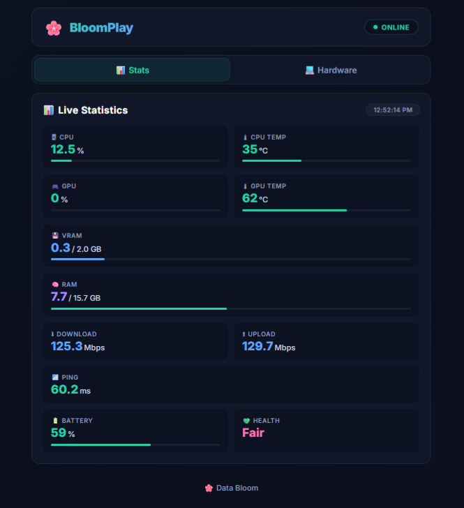
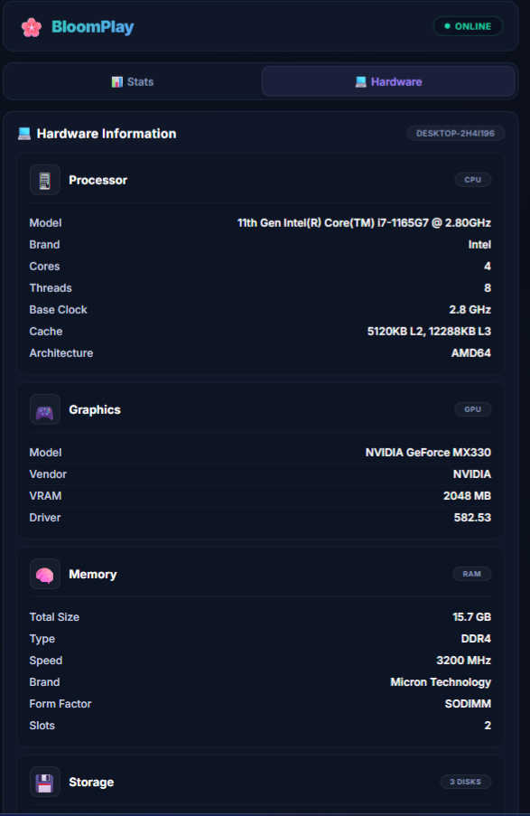

<div align="center">

# 🌸 BloomPlay

### Real-Time Desktop & Mobile System Monitoring Platform

Monitor your PC from both **Desktop** and **Mobile** with a modern, lightweight and beautiful dashboard.


</div>

---

# 📖 Overview

BloomPlay is a modern monitoring platform designed to provide real-time visibility into your computer's performance and hardware information.

Unlike traditional monitoring software, BloomPlay offers:

✅ Desktop Dashboard

✅ Mobile Dashboard

✅ QR-Based Instant Connection

✅ Hardware Inspection Center

✅ Live System Statistics

✅ Fully Local Communication

✅ Lightweight Architecture

---

# ✨ Key Features

| Feature               | Description                     |
| --------------------- | ------------------------------- |
| 🖥 CPU Monitoring     | Usage, Temperature, Performance |
| 🎮 GPU Monitoring     | Usage, Temperature, VRAM        |
| 🧠 RAM Monitoring     | Usage, Capacity, Percentage     |
| 🌐 Network Monitoring | Download, Upload, Ping          |
| 🔋 Battery Monitoring | Charge Level & Health           |
| 💾 Storage Monitoring | Drive Statistics                |
| 📱 Mobile Dashboard   | Browser-Based Monitoring        |
| 🔗 QR Connection      | One-Scan Access                 |
| 💻 Hardware Center    | Detailed Hardware Information   |

---

# ⚡ Real-Time Monitoring

BloomPlay continuously monitors your system and updates information live.

## 🖥 CPU

* Usage Percentage
* Temperature
* Live Performance Tracking
* Multi-Core Monitoring

## 🎮 GPU

* GPU Usage
* GPU Temperature
* VRAM Usage
* Dedicated Graphics Information

## 🧠 RAM

* Total Capacity
* Used Memory
* Available Memory
* Usage Percentage

## 🌐 Network

* Download Speed
* Upload Speed
* Ping / Latency
* Connection Monitoring

## 🔋 Battery

* Charge Percentage
* Battery Health
* Charging Status

---

# 🔍 Hardware Information Center

BloomPlay includes a dedicated hardware inspection mode.

---

## 🖥 Processor Information

| Information     | Available |
| --------------- | --------- |
| CPU Model       | ✅         |
| Manufacturer    | ✅         |
| Physical Cores  | ✅         |
| Logical Threads | ✅         |
| Clock Speed     | ✅         |
| Architecture    | ✅         |

---

## 🎮 Graphics Information

| Information      | Available |
| ---------------- | --------- |
| GPU Model        | ✅         |
| Vendor           | ✅         |
| VRAM Capacity    | ✅         |
| Graphics Details | ✅         |

---

## 🧠 Memory Information

| Information     | Available |
| --------------- | --------- |
| Total RAM       | ✅         |
| RAM Type        | ✅         |
| RAM Speed       | ✅         |
| Installed Slots | ✅         |
| Manufacturer    | ✅         |

---

## 💾 Storage Information

| Information         | Available |
| ------------------- | --------- |
| Total Storage       | ✅         |
| Drive Capacity      | ✅         |
| Used Space          | ✅         |
| Free Space          | ✅         |
| Usage Percentage    | ✅         |
| Multi-Drive Support | ✅         |

---

## 🔩 Motherboard & BIOS

| Information        | Available |
| ------------------ | --------- |
| Motherboard Model  | ✅         |
| Motherboard Vendor | ✅         |
| BIOS Version       | ✅         |

---

## 🪟 System Information

| Information      | Available |
| ---------------- | --------- |
| Operating System | ✅         |
| Windows Version  | ✅         |
| Hostname         | ✅         |
| Architecture     | ✅         |

---

# 📱 Mobile Dashboard

One of BloomPlay's flagship features.

No installation required.

No account required.

No cloud service required.

Simply:

1. Launch BloomPlay
2. Scan QR Code
3. Open Dashboard
4. Monitor Your PC

---

## Mobile Features

* 📊 Live Statistics
* 📱 Responsive Design
* ⚡ Real-Time Updates
* 💻 Hardware Information
* 🌐 Browser-Based Access
* 🔄 Auto Synchronization

---

# 🔗 Instant QR Connection

BloomPlay automatically generates a QR Code for your local dashboard.

```text
PC
 │
 │ FastAPI Server
 │
 ▼
QR Code
 │
 ▼
Mobile Browser
 │
 ▼
Real-Time Dashboard
```

---

# 🎨 User Interface

## Desktop Experience

* Modern Dark Theme
* Hardware Information Mode
* Live Statistics Mode
* System Tray Support
* QR Connection Panel
* Real-Time Refresh

## Mobile Experience

* Responsive Layout
* Hardware Cards
* Performance Cards
* Progress Indicators
* Touch-Friendly Interface

---

# ⚙️ Performance Optimized

BloomPlay is designed to stay lightweight while running continuously.

### Optimization Features

* Cached Hardware Detection
* Background Monitoring
* Efficient API Requests
* Low Resource Usage
* Fast Refresh Cycles
* Minimal CPU Overhead

---

# 🛠 Tech Stack

| Category           | Technologies          |
| ------------------ | --------------------- |
| Backend            | Python, FastAPI       |
| Desktop UI         | PyQt5                 |
| Frontend           | HTML, CSS, JavaScript |
| Hardware Detection | psutil, WMI, GPUtil   |
| Networking         | QR Code, Local API    |
| Monitoring         | Real-Time Statistics  |

---

# 📸 Screenshots

| Desktop Dashboard | Hardware Information Center |
|------------------|----------------------------|
|  |  |

| Mobile Dashboard | Mobile Hardware Information Center |
|-----------------|------------------------------------|
|  |  |

---

# 🌟 Highlights

> 💡 Fully Local Monitoring Solution

> ⚡ Real-Time Statistics

> 📱 Desktop + Mobile Experience

> 🔗 QR-Based Instant Connection

> 🔒 Privacy Friendly

> 🚀 Lightweight

> 🎨 Modern Interface

> 💻 Detailed Hardware Inspection

---

# 🚀 Future Plans

* Process Monitoring
* FPS Monitoring
* Temperature History
* Performance Graphs
* Export Reports
* Multi-Device Monitoring

---

# ❤️ About

BloomPlay started as a simple monitoring experiment and evolved into a complete monitoring platform capable of delivering real-time desktop and mobile insights.

Built with passion, curiosity and many late-night debugging sessions.

---

<div align="center">

### 🌸 Made with ❤️ by Data Bloom

</div>
